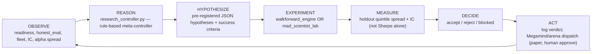

# Autonomous Research Machine

*Treasure Droid closed loop: observe forward truth → hypothesize → experiment → decide → act.*

Last updated: 2026-06-13

---

## North star

Beat the market **forward**, not in backtest. Sim and historical walk-forward are **candidate generators** only. Forward paper + tradeable quintile spread is the scoreboard.

---

## Architecture



### Components

| Layer | Script | Role |
|-------|--------|------|
| **Meta-controller** | `scripts/intelligence/research_controller.py` | Reads all forward metrics; emits falsifiable hypotheses; routes experiments; logs verdicts |
| **Walk-forward engine** | `scripts/intelligence/walkforward_engine.py` | Day-by-day historical replay; locked holdout tail; tradeable IC + quintile spread per day |
| **Genome lab** | `scripts/intelligence/historical/walkforward_lab.py` | Genome tournament on same panel (upper bound); fleet promotion requires walkforward spread confirm |
| **Captain (narrative)** | `scripts/intelligence/ultimate_model.py` + `megamind.py` | Human-approvable recommendations; arena spawn/update decisions |
| **Forward gate** | `scripts/intelligence/forward_gate.py` | Blocks promotion when forward paper / IC is red |
| **Fleet scoreboard** | `data/fleet/summary.json` | Forward paper P&L per agent |
| **Brain journal** | `scripts/intelligence/brain/journal.py` | Backtest + research cycle log |

### Artifacts

```
data/intelligence/research/
  latest_cycle.json      # last full OBSERVE→DECIDE cycle
  hypotheses.jsonl       # pre-registered hypotheses (append-only)
  verdicts.jsonl         # accept/reject with evidence (append-only)
  walkforward_latest.json
```

---

## Autonomous loop wiring

`scripts/autonomous_loop.ps1` supervises:

| Child | Cadence | Machine-to-machine? |
|-------|---------|---------------------|
| **research-controller** | 30 min | **Yes** — observe→experiment→verdict |
| megamind-agent | 5 min | Partial — queues Cursor tasks on approve |
| reasoning | 15 min | Paper portfolio tick |
| trader-arena | 1 h | Sim pulse (research) |
| mad-scientist | 3 h | Genome experiments |
| intelligence | 2 h | Forward IC / alpha measure |
| improve | 6 h | Harness |

Run standalone:

```powershell
# Full supervisor (includes research controller)
powershell -File scripts/autonomous_loop.ps1

# Research controller only
powershell -File scripts/continual_research.ps1 -IntervalMinutes 30

# One-shot dry run
$env:PYTHONPATH = "scripts"
python scripts/intelligence/research_controller.py --tick
python scripts/intelligence/research_controller.py --observe-only
```

---

## Promotion gate (scientific verdict)

A hypothesis is **accepted** only when holdout metrics clear pre-registered criteria:

1. `holdout.mean_quintile_spread > 0` (tradeable edge)
2. `holdout.mean_ic > 0` (when specified)
3. **Auto-reject** if ICIR/Sharpe looks good but quintile spread ≤ 0 (selection bias trap)

`--apply` does **not** open live trading. It logs dispatch hints for Megamind/arena (human approve still required).

**Mad Scientist fleet promotion:** survivors with strong holdout Sharpe are only added to the shadow fleet when `walkforward_engine` confirms `holdout.mean_quintile_spread > 0` on tradeable names. High Sharpe + negative spread is auto-rejected; rejections append to `verdicts.jsonl`.

---

## What's proven vs hoped-for

| Claim | Status |
|-------|--------|
| Forward rank IC ~0.025 on tradeable names | **Measured** (honest eval) |
| Raw quintile spread negative on tradeable | **Measured** — edge trapped in microcaps |
| Neutralized alpha can flip spread positive | **Hoped-for** — Phase A engine; walkforward tests it |
| Autonomous loop closes observe→act | **Partial** — research controller acts on rules; Megamind still needs human approve for code changes |
| Beat the market | **Not proven** — `edge_proven: false` |

---

## Machine-to-machine gap (before → after)

| Gap | Before | After |
|-----|--------|-------|
| Metrics → hypothesis | Megamind narrates; human approves | `research_controller` emits structured hypotheses with success criteria |
| Hypothesis → experiment | Manual / separate mad-scientist loop | Auto-routes to `walkforward_engine` or `mad_scientist` by type |
| Experiment → verdict | Holdout Sharpe in lab only | Verdict uses **tradeable quintile spread** on locked holdout |
| Verdict → action | None automated | Logged to `verdicts.jsonl` + brain journal; `--apply` hints dispatch |
| Unified scoreboard | 10+ conflicting % | Research cycle reads fleet + honest_eval + alpha_ic in one `observe()` |

### Still missing (next iterations)

- LLM meta-controller with strict falsifiable prompt (stretch)
- Auto Megamind approve for low-risk research dispatches
- Per-sleeve walkforward in registry lifecycle
- Fleet shadow→active promotion on forward metrics alone
- Single combined Alpaca book execution

---

## Arena policy (unchanged)

- v1/v2 **frozen** — never respawn
- Champion evolves via `harvest.py` + `real_agents.py`
- Challenger spawn **only** for new feed hypotheses (`decision.py`)
- Forward paper is scoreboard; readiness gate unchanged

---

## Related docs

- `docs/ALPHA_DOCTRINE.md` — Fundamental Law + alpha factory
- `docs/UNIFIED_ARCHITECTURE.md` — Sleeve abstraction + Megamind as captain
