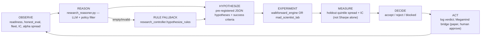

# Autonomous Research Machine

*Treasure Droid closed loop: observe forward truth → hypothesize → experiment → decide → act.*

Last updated: 2026-06-13 (LLM reasoning layer)

---

## North star

Beat the market **forward**, not in backtest. Sim and historical walk-forward are **candidate generators** only. Forward paper + tradeable quintile spread is the scoreboard.

---

## Architecture



### Components

| Layer | Script | Role |
|-------|--------|------|
| **Meta-controller** | `scripts/intelligence/research_controller.py` | Reads all forward metrics; routes experiments; logs verdicts |
| **LLM reasoner** | `scripts/intelligence/research_reasoner.py` | LLM proposes falsifiable hypotheses; policy filter; logs to `reasoning.jsonl` |
| **Rule fallback** | `research_controller.hypothesize_rules()` | Same hypotheses as before LLM layer — always available |
| **Walk-forward engine** | `scripts/intelligence/walkforward_engine.py` | Day-by-day historical replay; locked holdout tail; tradeable IC + quintile spread per day |
| **Genome lab** | `scripts/intelligence/historical/walkforward_lab.py` | Genome tournament on same panel (upper bound); fleet promotion requires walkforward spread confirm |
| **Captain (narrative)** | `scripts/intelligence/ultimate_model.py` + `megamind.py` | Human-approvable recommendations; arena spawn/update decisions |
| **Forward gate** | `scripts/intelligence/forward_gate.py` | Blocks promotion when forward paper / IC is red |
| **Fleet scoreboard** | `data/fleet/summary.json` | Forward paper P&L per agent |
| **Brain journal** | `scripts/intelligence/brain/journal.py` | Backtest + research cycle log |

### Artifacts

```
data/intelligence/research/
  latest_cycle.json      # last full OBSERVE→DECIDE cycle (includes reasoning meta)
  hypotheses.jsonl       # pre-registered hypotheses (append-only)
  verdicts.jsonl         # accept/reject with evidence (append-only)
  reasoning.jsonl        # LLM backend, accept/reject counts, raw preview
  walkforward_latest.json
```

---

## LLM reasoning layer

### Provider chain (first match wins)

| Priority | Provider | Env vars |
|----------|----------|----------|
| — | **Disabled** | `RESEARCH_LLM_DISABLED=1` → rules only |
| 1 | OpenAI-compatible | `OPENAI_API_KEY`, optional `OPENAI_BASE_URL`, `OPENAI_MODEL` |
| 2 | Anthropic | `ANTHROPIC_API_KEY`, optional `ANTHROPIC_MODEL` |
| 3 | Google Gemini | `GOOGLE_API_KEY` (via `npu_llm`) |
| 4 | **Rule fallback** | Always — `hypothesize_rules()` |

Secrets may also live in `config/secrets.json` (gitignored). Env vars win.

### System prompt constraints

The LLM is instructed to:

- Treat **forward paper Sharpe + tradeable quintile spread** as scoreboard; sim/backtest as upper bound only
- Emit **falsifiable** hypotheses with pre-registered `successCriteria`
- Reference **Grinold IR = IC × √Breadth × TC** (see `docs/ALPHA_DOCTRINE.md`)
- **Reject** Sharpe-without-spread promotions (selection bias)
- **Never** respawn/modify arena v1/v2, weaken readiness, or bypass spread gate

Outputs are validated and filtered in Python — invalid or policy-violating hypotheses are dropped before experiments run.

### Hypothesis schema (LLM → controller)

```json
{
  "id": "sha256[:12]",
  "type": "concentration_fix|alpha_tweak|genome_search|...",
  "statement": "If we X, tradeable quintile spread will improve because Y",
  "successCriteria": {"holdout_mean_quintile_spread_gt": 0.0},
  "route": "walkforward_engine|mad_scientist|observe_only|act_only",
  "params": {},
  "reasoning": "chain-of-thought summary",
  "confidence": 0.65,
  "priority": 1,
  "source": "llm"
}
```

### Megamind bridge (optional)

When a hypothesis is **accepted** and `--apply` is set:

- Default: dry-run dispatch hint in verdict log
- `RESEARCH_MEGAMIND_BRIDGE=1` + `--apply`: enqueues a **proposed** Megamind recommendation (human approve still required; no auto-build unless Megamind auto-approve rules fire separately)

Never bypasses spread gate or readiness gate.

---

## Autonomous loop wiring

`scripts/autonomous_loop.ps1` supervises:

| Child | Cadence | Machine-to-machine? |
|-------|---------|---------------------|
| **research-controller** | 30 min | **Yes** — observe→experiment→verdict |
| megamind-agent | 5 min | Partial — queues Cursor tasks on approve |
| reasoning | 15 min | Paper portfolio tick |
| trader-arena | 1 h | Sim pulse (research) |
| mad-scientist | 3 h | Genome experiments (auto-rebuilds panel when stale) |
| intelligence | 2 h | Forward IC / alpha measure |
| improve | 6 h | Harness |

Run standalone:

```powershell
# Full supervisor (includes research controller)
powershell -File scripts/autonomous_loop.ps1

# Research controller only
powershell -File scripts/continual_research.ps1 -IntervalMinutes 30

# One-shot dry run
$env:PYTHONPATH = "scripts"
python scripts/intelligence/research_controller.py --tick
python scripts/intelligence/research_controller.py --tick --no-llm   # rules only
python scripts/intelligence/research_controller.py --observe-only

# Enable LLM (set one of OPENAI_API_KEY / ANTHROPIC_API_KEY / GOOGLE_API_KEY)
python scripts/intelligence/research_controller.py --tick

# Unit tests (no API key)
python scripts/intelligence/test_research_reasoner.py
python -m compileall scripts/intelligence/research_reasoner.py scripts/intelligence/research_controller.py
```

---

## Promotion gate (scientific verdict)

A hypothesis is **accepted** only when holdout metrics clear pre-registered criteria:

1. `holdout.mean_quintile_spread > 0` (tradeable edge)
2. `holdout.mean_ic > 0` (when specified)
3. **Auto-reject** if ICIR/Sharpe looks good but quintile spread ≤ 0 (selection bias trap)

`--apply` does **not** open live trading. It logs dispatch hints for Megamind/arena (human approve still required).

**Mad Scientist fleet promotion:** survivors with strong holdout Sharpe are only added to the shadow fleet when `walkforward_engine` confirms `holdout.mean_quintile_spread > 0` on tradeable names. High Sharpe + negative spread is auto-rejected; rejections append to `verdicts.jsonl`.

**Fleet walk-forward promotion** (`fleet/backtest.py --promote`): same spread gate via shared `spread_gate.py` — no bypass for test.csv survivors.

---

## What's proven vs hoped-for

| Claim | Status |
|-------|--------|
| Forward rank IC ~0.025 on tradeable names | **Measured** (honest eval) |
| Raw quintile spread negative on tradeable | **Measured** — edge trapped in microcaps |
| Neutralized alpha can flip spread positive | **Hoped-for** — Phase A engine; walkforward tests it |
| Autonomous loop closes observe→act | **Partial** — LLM reasons + rules fallback; Megamind still needs human approve for code changes |
| LLM meta-controller | **Implemented** — `research_reasoner.py`; policy filter; rules fallback |
| Beat the market | **Not proven** — `edge_proven: false` |

---

## Machine-to-machine gap (before → after)

| Gap | Before | After |
|-----|--------|-------|
| Metrics → hypothesis | Megamind narrates; human approves | LLM + rules emit structured hypotheses with success criteria |
| Hypothesis → experiment | Manual / separate mad-scientist loop | Auto-routes to `walkforward_engine` or `mad_scientist` by type |
| Experiment → verdict | Holdout Sharpe in lab only | Verdict uses **tradeable quintile spread** on locked holdout |
| Verdict → action | None automated | Logged to `verdicts.jsonl` + brain journal; `--apply` hints dispatch |
| Unified scoreboard | 10+ conflicting % | Research cycle reads fleet + honest_eval + alpha_ic in one `observe()` |

### Still missing (next iterations)

- Auto Megamind approve for low-risk research dispatches (still human-gated for code)
- Per-sleeve walkforward in registry lifecycle
- Fleet shadow→active promotion on forward metrics alone
- Single combined Alpaca book execution
- LLM cannot yet autonomously change genomes, weights, or live gates — only propose testable experiments

---

## Arena policy (unchanged)

- v1/v2 **frozen** — never respawn
- Champion evolves via `harvest.py` + `real_agents.py`
- Challenger spawn **only** for new feed hypotheses (`decision.py`)
- Forward paper is scoreboard; readiness gate unchanged

---

## Related docs

- `docs/ALPHA_DOCTRINE.md` — Fundamental Law + alpha factory
- `docs/UNIFIED_ARCHITECTURE.md` — Sleeve abstraction + Megamind as captain
